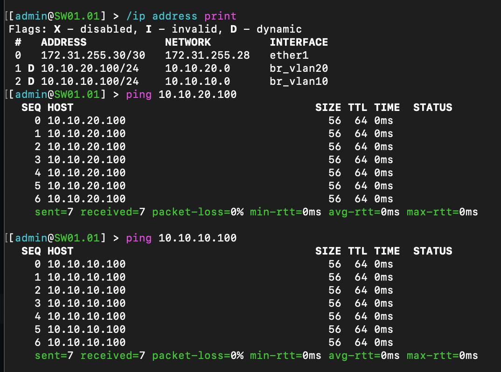
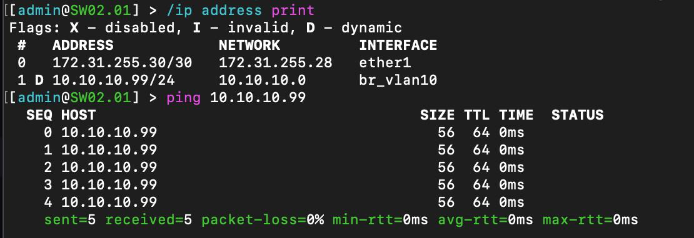
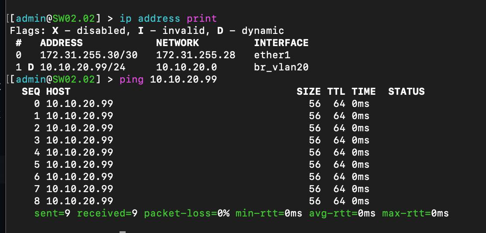
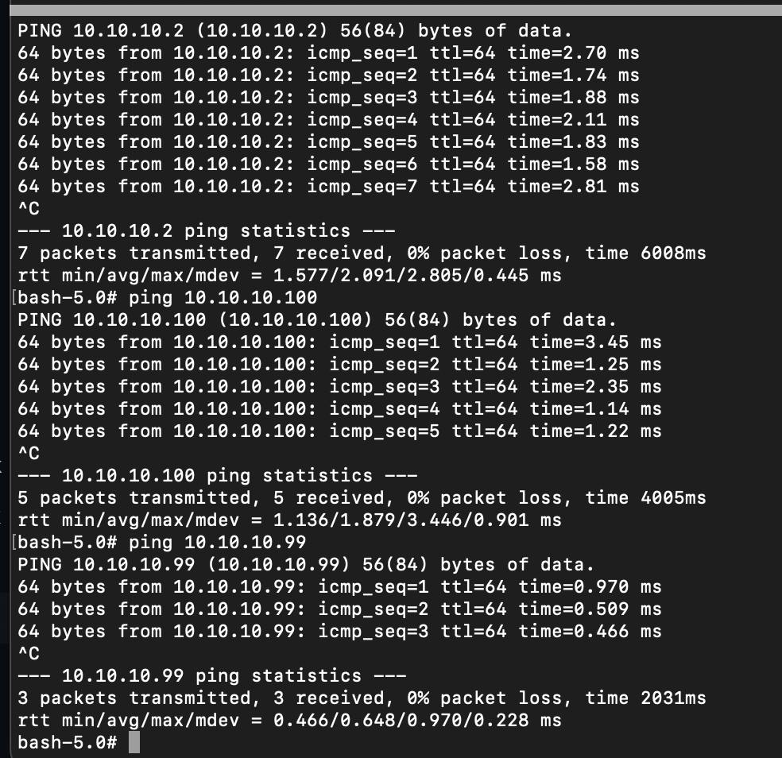
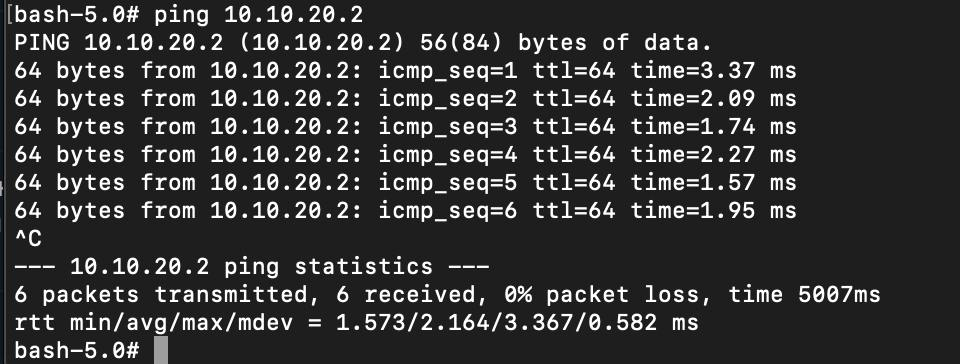
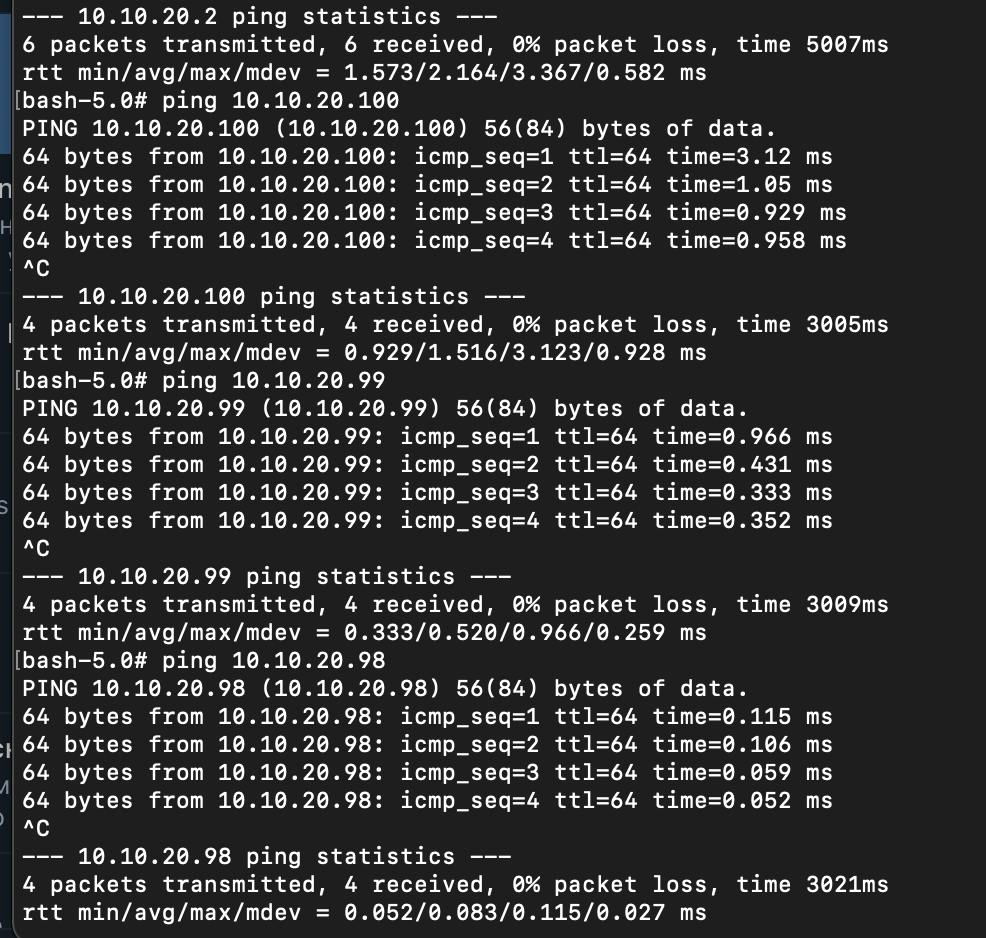

University: [ITMO University](https://itmo.ru/ru/)

Faculty: [FICT](https://fict.itmo.ru)

Course: [Introduction in routing](https://github.com/itmo-ict-faculty/introduction-in-routing)

Year: 2024/2025

Group: K3320

Author: Fatin Alexey Andreevich

Lab: Lab1

Date of create: 19.09.2024

Date of finished: 22.09.2024

# Отчёт по лабораторной работе №1 "Установка ContainerLab и развертывание тестовой сети связи"

***Цель:*** ознакомиться с инструментом ContainerLab и методами работы с ним, изучить работу VLAN, IP адресации и т.д.

## Ход работы

Первым делом было много попыток установки Ubuntu на виртуальную машину локально, но из-за особенностей их реализации на Mac, это не приводило к успешным результатам.

Была арендована базовая ВМ в Selectel, через SSH выполнялись шаги по настройке окружения (Docker, ContainerLab) и конфигурации сетевых нод.

В yaml-файле была задана топология сети, указанная на схеме

### После задания конфигураций нод, проверим работоспособность:

#### PC1

#### PC2

