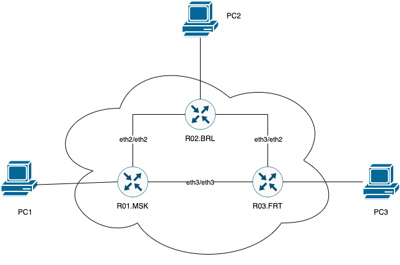
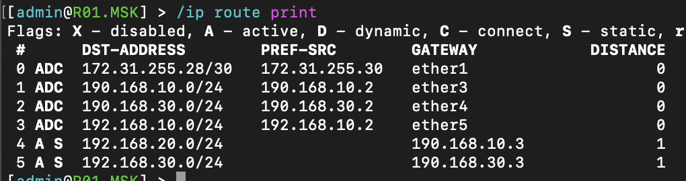
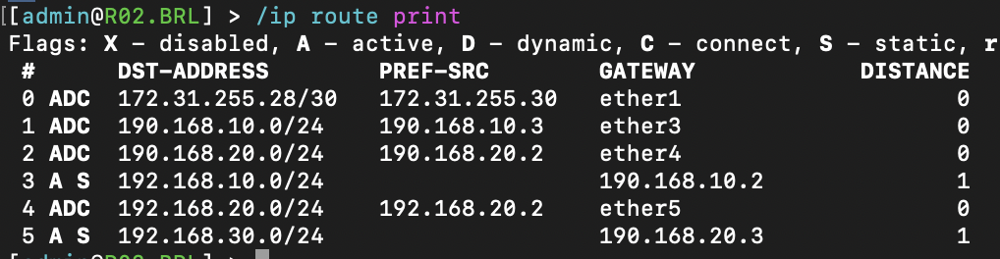
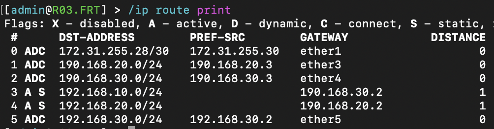

University: [ITMO University](https://itmo.ru/ru/)

Faculty: [FICT](https://fict.itmo.ru)

Course: [Introduction in routing](https://github.com/itmo-ict-faculty/introduction-in-routing)

Year: 2024/2025

Group: K3320

Author: Fatin Alexey Andreevich

Lab: Lab2

Date of create: 06.10.2024

Date of finished: 09.10.2024

# Отчёт по лабораторной работе №2 "Эмуляция распределенной корпоративной сети связи, настройка статической маршрутизации между филиалами"

Создадим топологию с помощью конфигурации в файле lab2.yaml, сконфигурируем сетевые устройства

### R01.MSK Route tables

### R02.BRL Route tables

### R03.BRL Route tables

## Работоспособность

### PC1 -> PC2, PC3

23.png">

### PC2 -> PC1, PC3

13.png">

### PC3 -> PC1, PC2

12.png">

## Проблемы, с которыми столкнулся 

- В таблицах маршрутизации компьютеров правило `default via 192.168.100.1` имело больший metric, поэтому устройства в других подсетях не пинговались. Нет правила, нет проблем =)

- Почему-то при установке базованной ubuntu в терминале не было практически ничего, apk, ifconfig'a. В предыдущей лабораторной работе такого не было, здесь поменял на alpine.

