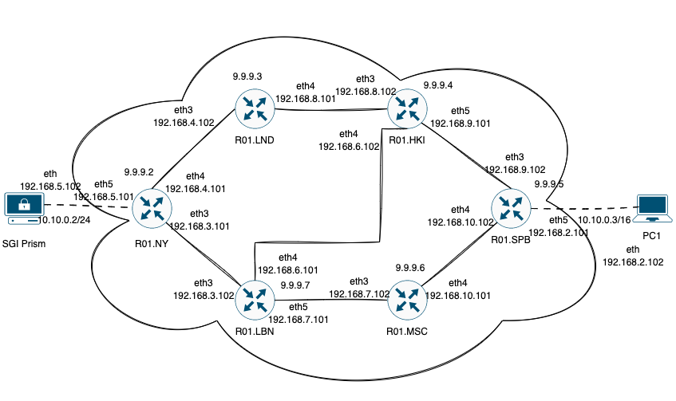

University: [ITMO University](https://itmo.ru/ru/)

Faculty: [FICT](https://fict.itmo.ru)

Course: [Introduction in routing](https://github.com/itmo-ict-faculty/introduction-in-routing)

Year: 2024/2025

Group: K3320

Author: Fatin Alexey Andreevich

Lab: Lab3

Date of create: 26.10.2024

Date of finished: 02.11.2024

# Отчёт по лабораторной работе №3 "Эмуляция распределенной корпоративной сети связи, настройка OSPF и MPLS, организация первого EoMPLS"

Создадим топологию с помощью конфигурации в файле lab3.yaml, сконфигурируем сетевые устройства

## R01.NY

## R01.LND

## R01.HKI

## R01.SPB

## R01.MSC

## R01.LBN

# Результаты пингов 

### PC1 -> SGI_PRISM:

SGI_PRISM.png">

### SGI_PRISM -> PC1:

PC1.png">

