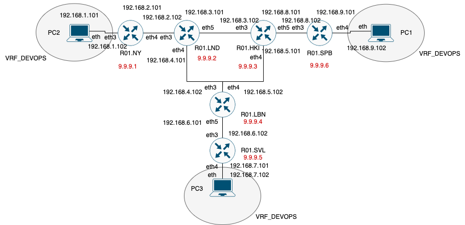
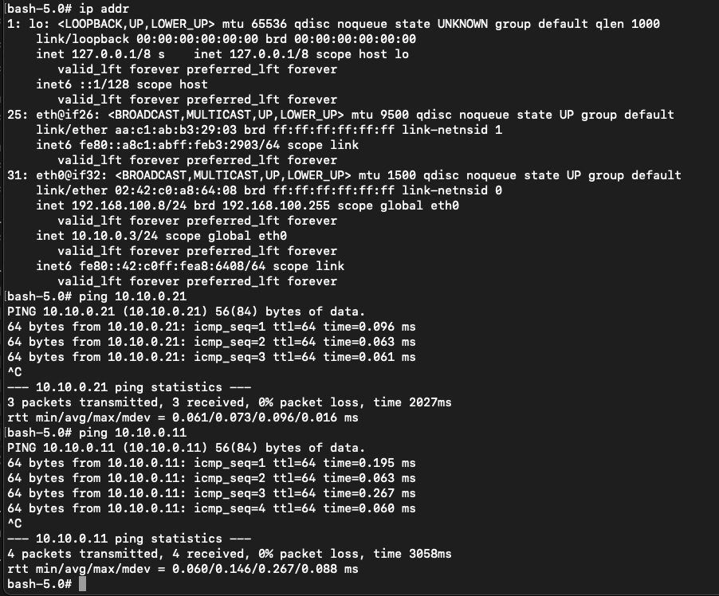
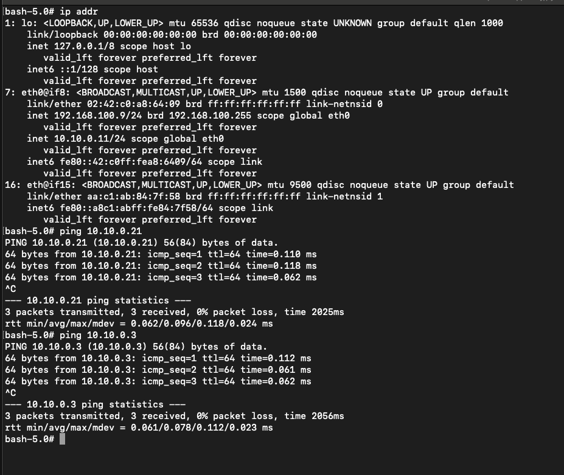
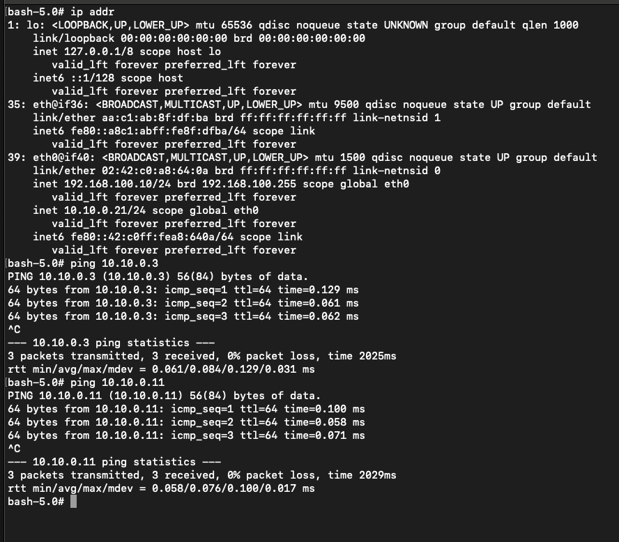

University: [ITMO University](https://itmo.ru/ru/)

Faculty: [FICT](https://fict.itmo.ru)

Course: [Introduction in routing](https://github.com/itmo-ict-faculty/introduction-in-routing)

Year: 2024/2025

Group: K3320

Author: Fatin Alexey Andreevich

Lab: Lab4

Date of create: 10.11.2024

Date of finished: 11.11.2024

# Отчёт по лабораторной работе №4 "Эмуляция распределенной корпоративной сети связи, настройка iBGP, организация L3VPN, VPLS"

Создадим топологию с помощью конфигурации в файле lab4.clab.yaml, сконфигурируем сетевые устройства

## Часть 1 

### Пинг из R01.NY в R01.SPB и R01.SVL:

SPB&SVL.png">

### Пинг из R01.SPB в R01.NY и R01.SVL:

NY&SVL.png">

### Пинг из R01.SVL в R01.NY и R01.SPB:

SPB&NY.png">

## Часть 2

### PC1 -> PC2, PC3

### PC2 -> PC1, PC3

### PC3 -> PC1, PC2

